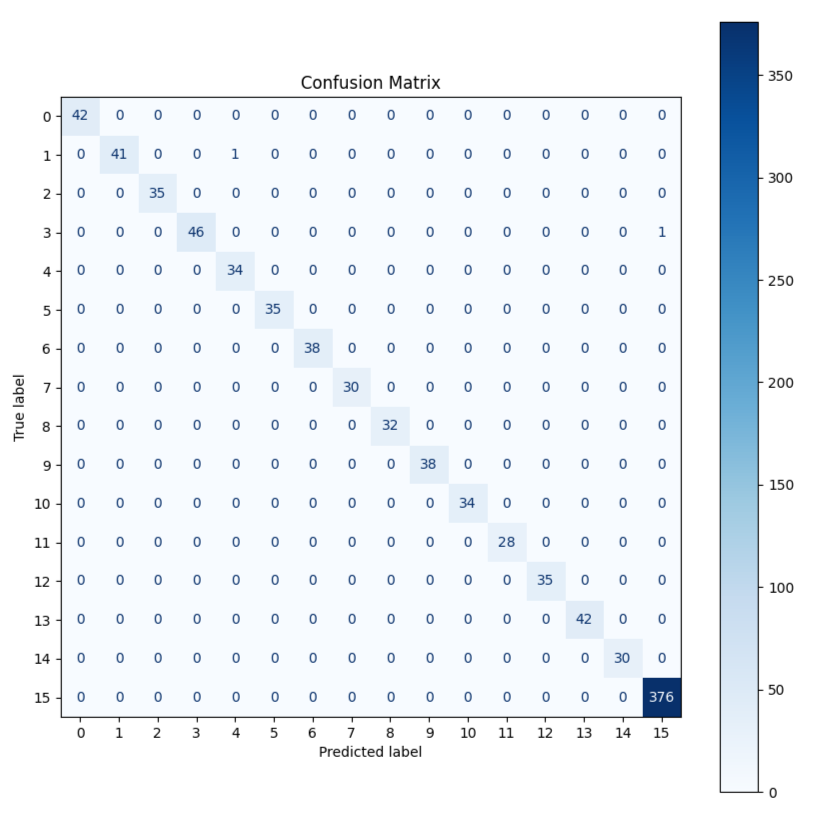
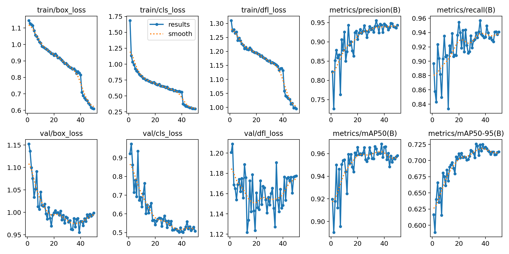

# 🌟 CelebVision: Multi-Pipeline Celebrity Recognition System

<div align="center">


**Complete AI pipeline combining YOLOv11 face detection, gender classification, and EfficientNetV2-S celebrity recognition for 15 Pakistani celebrities.**

[📊 Kaggle Model](https://kaggle.com/models/syedburhanahmed/cv-project-part-1celebrity-detection) • [🏆 Competition Results](#competition-achievements) • [🚀 Quick Start](#quick-start) • [📁 Project Structure](#project-structure)

</div>

## Competition Achievements

- **🥇 1st Place** in CV Kaggle Competition (50+ students)  
- **📈 F1 Score:** 0.973 public, 1.000 private leaderboard
- **🎯 mAP@0.5:** 0.966 for face detection and gender classification
- **⚡ Real-time inference** on multi-person images

## Project Overview

CelebVision is an end-to-end computer vision system that processes images to:

1. **🔍 Detect faces** using fine-tuned YOLOv11
2. **⚖️ Classify gender** (Male/Female) with colored bounding boxes  
3. **🌟 Recognize celebrities** from 15 Pakistani personalities + "others" class
4. **🎨 Visualize results** with annotated bounding boxes and labels

### Technical Innovation

- **Multi-pipeline architecture** combining object detection and classification
- **Handles severe class imbalance** (2000 "others" vs 180-200 per celebrity)
- **Compact YOLO model** (5.2MB) with high accuracy
- **Transfer learning** with EfficientNetV2-S backbone

## Quick Start

### Prerequisites

```

python >= 3.8
CUDA-capable GPU (recommended)

```

### Installation

1. **Clone the repository**
```

git clone https://github.com/yourusername/celebvision.git
cd celebvision

```

2. **Install dependencies**
```

pip install -r requirements.txt

```

3. **Download pre-trained models**
```

import kagglehub

# Download celebrity classifier (EfficientNetV2-S)

classifier_path = kagglehub.model_download("syedburhanahmed/cv-project-part-1celebrity-detection/pyTorch/default")

# YOLO model is included in the repository (models/yolo_gender_detection.pt)

```

### Basic Usage

```

from ultralytics import YOLO
import torch
from torchvision.models import efficientnet_v2_s

# Load models

yolo_model = YOLO('models/yolo_gender_detection.pt')
classifier_model = load_celebrity_classifier()  \# See notebook for implementation

# Run complete pipeline

results = celebrity_recognition_pipeline('path/to/your/image.jpg')

```

## Project Structure

```

celebvision/
├── 📊 notebooks/                                    \# Jupyter notebooks
│   ├── part1_pakistani_celebrity_classifier.ipynb  \# Individual classifier training
│   └── celebvision_complete_pipeline.ipynb         \# Full pipeline (YOLO + classifier)
├── 🤖 models/                                       \# Model weights \& info
│   ├── yolo_gender_detection.pt                    \# YOLO weights (5.2MB)
│   └── README.md                                    \# Model documentation
├── 📈 results/                                      \# Performance visualizations
│   ├── classifier/                                  \# EfficientNet results
│   │   ├── training_loss_accuracy_curves.png
│   │   └── confusion_matrix.png
│   └── yolo/                                        \# Complete YOLO training results
│       ├── training_metrics.png
│       ├── f1_confidence_curve.png
│       ├── precision_recall_curve.png
│       ├── validation_predictions.png
│       └── [all YOLO training curves]
├── 📋 requirements.txt                              \# Dependencies
└── 📖 README.md                                     \# This file

```

## Results and Performance

### Part 1: Celebrity Classifier (EfficientNetV2-S)
| Metric | Public | Private |
|--------|--------|---------|
| F1 Score | 0.973 | 1.000 |
| Accuracy | >98% | Perfect |
| **Competition Rank** | **🥇 1st/50+** | **🥇 1st/50+** |

### Part 2: YOLO Gender Detection
| Metric | Score |
|--------|-------|
| mAP@0.5 | 0.966 |
| Precision | >95% |
| Recall | >90% |
| Model Size | 5.2MB |





## Technical Details

### Model Architecture
- **Detection**: YOLOv11n fine-tuned on custom dataset (5.2MB)
- **Classification**: EfficientNetV2-S with transfer learning (~80MB)
- **Pipeline**: Integrated two-stage inference system

### Dataset Handling
- **Class Imbalance**: Handled with WeightedRandomSampler
- **Augmentations**: Mixup, cutout, color transformations
- **Training Strategy**: Frozen backbone → fine-tuned last 5 blocks

### Key Features
- ✅ Real-time multi-person processing
- ✅ Gender-coded bounding boxes (Blue: Male, Pink: Female)
- ✅ Celebrity name predictions with confidence scores
- ✅ Compact YOLO model suitable for deployment

## Notebooks Overview

1. **Celebrity Classifier** - Training EfficientNetV2-S for 16-class classification with competition-winning results
2. **Complete Pipeline** - **End-to-end implementation** including YOLO training, classifier integration, and full inference pipeline

## Competition Context

This project was developed as part of Computer Vision coursework under **Sir Azeem's** guidance, where all assignments were conducted as Kaggle competitions. This competitive format encouraged rigorous optimization and real-world ML practices.

## Links and Resources

- 🏆 **Kaggle Classifier Model**: [Pakistani Celebrity Recognition](https://kaggle.com/models/syedburhanahmed/cv-project-part-1celebrity-detection)
- 📊 **Competition**: [CV Project Leaderboard](https://www.kaggle.com/competitions/s-2025-multi-class-pretraied-network-project)
- 📋 **Model Documentation**: [models/README.md](models/README.md)

## Contributing

Contributions are welcome! Please feel free to submit a Pull Request. For major changes, please open an issue first to discuss what you would like to change.

## License

This project is licensed under the MIT License - see the [LICENSE](LICENSE) file for details.

## Author

**Syed Burhan Ahmed**
- 🎓 Student at University of Management and Technology
- 🏆 1st Place in CV Kaggle Competition  
- 📧 Contact: [syedburhanahmedd@gmail.com]
- 💼 LinkedIn: [https://www.linkedin.com/in/syed-burhan-ahmed/]

## Acknowledgments

- **Sir Azeem** - Course instructor and mentor
- **University of Management and Technology** - Academic support
- **Kaggle Community** - Platform and competitive environment
- **PyTorch & Ultralytics Teams** - Excellent frameworks

## Future Enhancements

- [ ] Model ensemble for improved accuracy
- [ ] Real-time webcam inference
- [ ] Mobile app deployment
- [ ] Extended celebrity database
- [ ] Age prediction integration

---

<div align="center">
<b>⭐ Star this repository if you found it helpful!</b>
</div>
